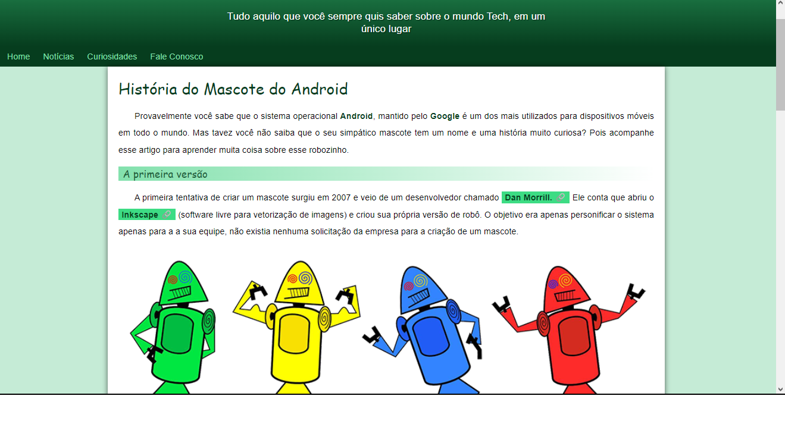

# projeto-android

É um projeto de um **Site Responsivo** que aprendi a desenvolver através do curso de **HTML** e **CSS** do **Gustavo Guanabara**

link: [Curso em Vídeo](https://www.youtube.com/@CursoemVideo)

# Como usar

Para poder visualizar o site, basta apenas fazer o **Clone** deste repositório para a sua máquina, e em seguida abrir o arquivo **"index.html"**.
